# Application Layer Architecture

```mermaid
graph TB
    %% External Systems
    subgraph "External Systems"
        SC[Spacecraft Systems]
        TC[Mission Control/Telemetry]
        SW[Space Weather Feeds<br/>NOAA SWPC, ESA SSA]
        ML[ML Frameworks<br/>TensorFlow, PyTorch]
        HW[Hardware Systems<br/>RAD750, FPGA]
    end

    %% Application Layer Main Interface
    subgraph "Application Layer - Mission-Aware Abstraction"
        API[Unified API Interface<br/>Zero-Code Integration]
        CFG[Mission Configuration<br/>Management System]
    end

    %% Core Components
    subgraph "ML Inference Protection"
        MIP1[Radiation-Hardened<br/>Inference Pipelines]
        MIP2[Adaptive Protection<br/>Scaling]
        MIP3[Multi-Level Error<br/>Recovery]
        MIP4[Performance<br/>Monitoring]
    end

    subgraph "Space Mission Simulation"
        SMS1[Physics-Based<br/>Environment Modeling]
        SMS2[Pre-Configured<br/>Mission Profiles]
        SMS3[Real-Time Trajectory<br/>Integration]
        SMS4[Mission Phase<br/>Transitions]
    end

    subgraph "Mission-Critical Validation"
        MCV1[Continuous Health<br/>Monitoring]
        MCV2[Monte Carlo Statistical<br/>Validation 28.8M+ trials]
        MCV3[Long-Duration Mission<br/>Testing 365+ days]
        MCV4[Automated Fault<br/>Injection]
    end

    subgraph "Custom Defense API"
        CDA1[Pluggable Strategy<br/>Architecture]
        CDA2[Mission-Specific<br/>Optimization]
        CDA3[Hardware Acceleration<br/>Integration]
        CDA4[Resource-Aware<br/>Configuration]
    end

    subgraph "Spacecraft Telemetry Integration"
        STI1[Real-Time Environment<br/>Adaptation]
        STI2[Orbital Position<br/>Awareness]
        STI3[Solar Activity<br/>Monitoring]
        STI4[Multi-Mission<br/>Communication]
    end

    subgraph "Radiation-Aware Training"
        RAT1[Dynamic Model<br/>Retraining]
        RAT2[Bit-Flip Injection<br/>Training]
        RAT3[Weight Criticality<br/>Analysis]
        RAT4[Performance Recovery<br/>Tracking]
    end

    %% Mission Profiles
    subgraph "Mission Profiles"
        LEO[LEO Earth<br/>Observation]
        GEO[GEO Communications]
        LUNAR[Lunar Operations]
        MARS[Mars Exploration]
        JUPITER[Jupiter Flyby]
        DEEP[Deep Space]
    end

    %% Protection Strategies
    subgraph "Protection Strategies"
        TMR[Enhanced TMR]
        RS[Reed-Solomon]
        PD[Physics-Driven]
        ML_STRAT[Multi-Layered]
        CUSTOM[Custom Strategies]
    end

    %% Data Flows
    SC --> STI1
    TC --> STI4
    SW --> STI3
    ML --> API
    HW --> CDA3

    API --> MIP1
    API --> SMS1
    API --> MCV1
    API --> CDA1
    API --> STI1
    API --> RAT1

    CFG --> LEO
    CFG --> GEO
    CFG --> LUNAR
    CFG --> MARS
    CFG --> JUPITER
    CFG --> DEEP

    STI1 --> MIP2
    STI2 --> SMS4
    STI3 --> MIP2
    STI4 --> MCV1

    SMS3 --> STI2
    SMS4 --> CDA2

    MCV2 --> RAT4
    MCV3 --> MIP4
    MCV4 --> RAT2

    CDA1 --> TMR
    CDA1 --> RS
    CDA1 --> PD
    CDA1 --> ML_STRAT
    CDA1 --> CUSTOM

    RAT3 --> CDA2
    RAT1 --> MIP1
    RAT2 --> MCV4

    %% Mission-specific connections
    LEO --> CDA2
    GEO --> CDA2
    LUNAR --> CDA2
    MARS --> CDA2
    JUPITER --> CDA2
    DEEP --> CDA2

    %% Styling for readability
    classDef external fill:#2196F3,stroke:#1976D2,stroke-width:2px,color:#FFFFFF
    classDef core fill:#4CAF50,stroke:#388E3C,stroke-width:2px,color:#FFFFFF
    classDef mission fill:#FF9800,stroke:#F57C00,stroke-width:2px,color:#FFFFFF
    classDef strategy fill:#9C27B0,stroke:#7B1FA2,stroke-width:2px,color:#FFFFFF
    classDef api fill:#F44336,stroke:#D32F2F,stroke-width:2px,color:#FFFFFF

    class SC,TC,SW,ML,HW external
    class MIP1,MIP2,MIP3,MIP4,SMS1,SMS2,SMS3,SMS4,MCV1,MCV2,MCV3,MCV4,CDA1,CDA2,CDA3,CDA4,STI1,STI2,STI3,STI4,RAT1,RAT2,RAT3,RAT4 core
    class LEO,GEO,LUNAR,MARS,JUPITER,DEEP mission
    class TMR,RS,PD,ML_STRAT,CUSTOM strategy
    class API,CFG api
```

## Component Details

### 🔵 External Systems Integration
- **Spacecraft Systems**: Real-time telemetry and system status
- **Mission Control**: Ground-based monitoring and command interfaces
- **Space Weather Feeds**: NOAA SWPC and ESA SSA radiation environment data
- **ML Frameworks**: TensorFlow, PyTorch integration with zero code modification
- **Hardware Systems**: RAD750, RAD5545, and FPGA acceleration support

### 🔴 Unified API Interface
- **Zero-Code Integration**: Drop-in replacement for standard ML inference calls
- **Mission Configuration Management**: Centralized profile deployment system
- **Framework Agnostic**: Supports multiple ML frameworks with consistent interface
- **Performance Optimization**: Intelligent resource allocation and monitoring

### 🟢 Core Protection Components

#### ML Inference Protection
- **Radiation-Hardened Pipelines**: TMR protection with automatic error detection
- **Adaptive Scaling**: Dynamic protection based on real-time radiation levels
- **Multi-Level Recovery**: Temporal redundancy → Model fallback → System recovery
- **Performance Monitoring**: Real-time accuracy and overhead tracking

#### Space Mission Simulation
- **Physics-Based Modeling**: NASA OLTARIS and ESA SPENVIS compliance
- **Mission Profiles**: Pre-configured LEO, GEO, lunar, Mars, Jupiter, deep space
- **Trajectory Integration**: Orbital mechanics with SAA and solar event prediction
- **Phase Transitions**: Automatic protection adjustment across mission phases

#### Mission-Critical Validation
- **Health Monitoring**: Continuous accuracy degradation and corruption detection
- **Monte Carlo Validation**: 28.8M+ trial statistical testing framework
- **Long-Duration Testing**: Multi-year mission reliability validation
- **Fault Injection**: Systematic testing with real space radiation data

#### Custom Defense API
- **Pluggable Architecture**: Factory pattern for custom protection strategies
- **Mission Optimization**: Automatic strategy selection per mission profile
- **Hardware Integration**: Seamless RAD-hard processor and FPGA support
- **Resource Awareness**: Dynamic adjustment based on power and compute budgets

#### Spacecraft Telemetry Integration
- **Environment Adaptation**: Real-time protection level adjustment
- **Position Awareness**: GPS integration for location-dependent protection
- **Solar Monitoring**: Space weather integration for proactive protection
- **Multi-Mission Support**: Constellation operations with shared environment data

#### Radiation-Aware Training
- **Dynamic Retraining**: Continuous model adaptation to radiation damage
- **Bit-Flip Training**: Controlled radiation simulation during training
- **Criticality Analysis**: Automatic identification of sensitive parameters
- **Recovery Tracking**: Quantitative resilience measurement and improvement

### 🟠 Mission Profiles
Automated configuration for different space environments:
- **LEO Earth Observation**: Selective TMR, 60-second checkpointing
- **GEO Communications**: Register TMR, 30-second intervals
- **Lunar Operations**: Complete TMR, 10-second checkpointing
- **Mars Exploration**: Complete TMR, 5-second intervals
- **Jupiter Flyby**: Maximum protection, 1-second checkpointing
- **Deep Space**: Adaptive multi-layered protection

### 🟣 Protection Strategies
Comprehensive radiation defense options:
- **Enhanced TMR**: Basic triple modular redundancy with checksums
- **Reed-Solomon**: Advanced error correction codes
- **Physics-Driven**: Quantum-enhanced radiation transport models
- **Multi-Layered**: Combined spatial and temporal redundancy
- **Custom Strategies**: User-defined protection algorithms

**Minor Implementation Limitations**:
- **Space Weather Integration**: While comprehensive radiation environment modeling exists, direct NOAA SWPC/ESA SSA feed integration represents planned capability rather than current implementation
- **Hardware Acceleration**: Framework supports RAD750 and FPGA integration, but specific GPU acceleration may be limited in current implementation
