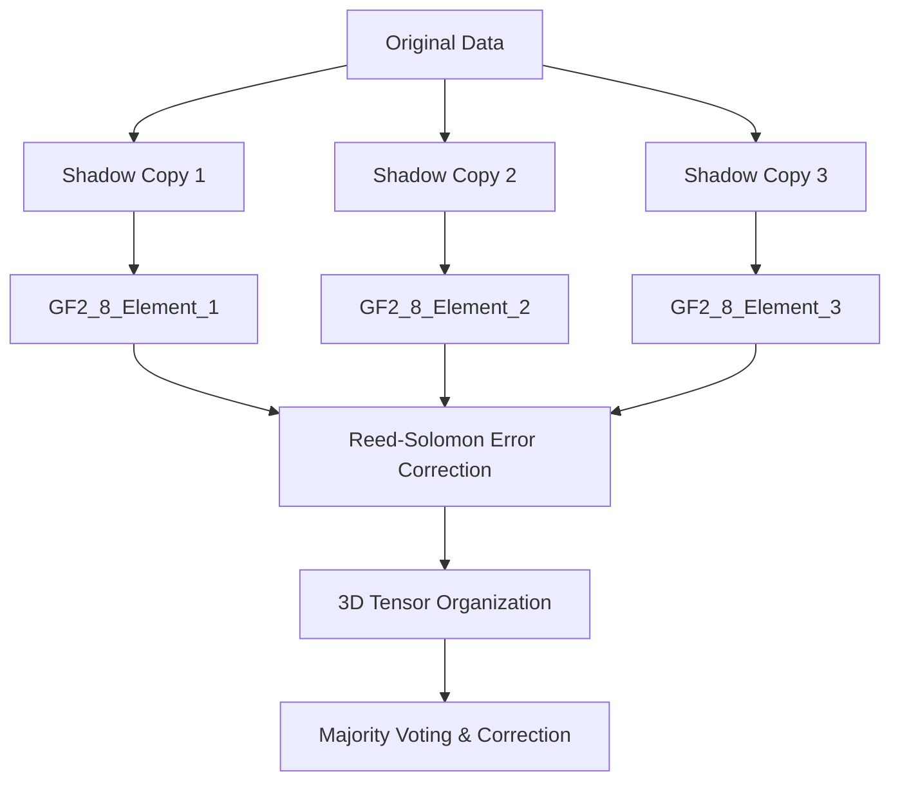

# Shadow Numbers, Galois Fields, and 3D Tensors in Radiation-Tolerant Memory Protection

> **Note:** Math formulas are shown as code blocks for GitHub compatibility. Mermaid diagrams are in fenced code blocks. GitHub does not natively render LaTeX math, but you can copy formulas into a LaTeX tool for proper rendering.

## Overview

This document explains how **shadow numbers**, **Galois fields**, and **3D tensors** are integrated to create a robust, radiation-tolerant memory protection system. The approach is based on real code and design patterns from the codebase, combining mathematical error correction, physical memory organization, and advanced redundancy.

> **Why This Matters:**
> Space radiation can corrupt memory, causing bit flips and data loss. Combining redundancy, error correction, and physical separation is essential for mission-critical reliability.

---

## 1. Shadow Numbers: The Foundation of Redundancy

**Shadow numbers** are redundant copies of critical data, used to detect and correct errors caused by radiation-induced memory corruption.

> **Explanation:**
> By keeping multiple copies (shadows) of the same value, the system can compare them and use majority voting to recover the correct value if one copy is corrupted. This is the basis of Triple Modular Redundancy (TMR).

### Mathematical Principle: Majority Voting
If you have three copies x1, x2, x3, the majority value is:

```text
Majority(x1, x2, x3) =
    x1 if x1 == x2 or x1 == x3
    x2 if x2 == x3
    undefined otherwise
```

> **Physical Principle:**
> The probability that a single event upsets (SEU) all three copies simultaneously is much lower if they are physically separated:
>
```text
P_all_damaged ≈ (P_SEU)^3
```
> where P_SEU is the probability of a bit flip in one location.

### Example: Triple Modular Redundancy (TMR)
```cpp
// Three shadow copies for TMR
float value1 = original;
float value2 = original;
float value3 = original;
// Majority voting for error correction
float result = (value1 == value2) ? value1 : (value2 == value3) ? value2 : value3;
```
> **How it works:**
> If one value is corrupted by radiation, the other two can "outvote" it, ensuring the correct value is used.

- **Physical separation**: Shadow copies are stored in different memory locations, often with alignment and padding to prevent a single radiation event from corrupting multiple copies.

#### Try It Yourself: Shadow Numbers in Practice
- **Exercise:**
  1. Open `test/verification/radiation_stress_test.cpp` and find the `RadiationTestNetwork` class.
  2. Modify one of the shadow copies (e.g., `weights1_copy2`) to simulate a bit flip.
  3. Run the forward pass and observe how the majority voting logic recovers the correct value.
- **Bonus:** Try changing two copies and see what happens—can the system still recover?

---

## 2. Galois Fields: Mathematical Error Correction

**Galois fields** (finite fields, e.g., GF(2^8)) provide the mathematical foundation for error correction codes like Reed-Solomon. Each shadow copy can be treated as a field element, enabling powerful correction algorithms.

> **Explanation:**
> Galois field arithmetic allows us to encode data with extra "parity" information. If some data is corrupted, the system can mathematically reconstruct the original using the error correction code.

### Mathematical Principle: Galois Field Operations
A Galois field GF(2^m) is a set of 2^m elements with addition and multiplication defined as:

- **Addition:**
```text
a + b = a XOR b
```
- **Multiplication:**
```text
a * b = GF-mult(a, b) // using a primitive polynomial
```

### Reed-Solomon Encoding/Decoding
Given a message polynomial m(x) and generator polynomial g(x):
- **Encoding:**
```text
c(x) = m(x) * x^(n-k) + r(x)
```
where r(x) is the remainder when dividing m(x) * x^(n-k) by g(x).
- **Syndrome Calculation:**
```text
S_i = r(alpha^i),  for i = 1, ..., 2t
```
where alpha is a primitive element of the field.
- **Error Correction:**
Uses algorithms like Berlekamp-Massey and Forney's to locate and correct errors.

> **How it works:**
> Reed-Solomon codes can detect and correct multiple errors in a block of data, not just single-bit errors. This is crucial for space systems where burst errors are common.

- **Shadow numbers as field elements**: Each redundant copy is encoded as a Galois field element, allowing for detection and correction of multiple simultaneous errors.

#### Try It Yourself: Reed-Solomon in Action
- **Exercise:**
  1. Open `include/rad_ml/neural/advanced_reed_solomon.hpp` and look for the `encode` and `decode` methods.
  2. In a test or main function, create a data value, encode it with Reed-Solomon, then manually flip a few bits in the encoded data.
  3. Use the `decode` method to recover the original value. Observe how many errors can be corrected.
- **Bonus:** Try increasing the number of errors and see when the code can no longer recover the original data.

---

## 3. 3D Tensors: Spatial and Temporal Organization

**3D tensors** are used to organize shadow numbers in space (and sometimes time), providing physical separation and mapping to real-world memory layouts or simulation grids.

> **Explanation:**
> By spreading shadow copies across a 3D grid (in memory or in a simulation), the system reduces the chance that a single radiation event will corrupt all copies at once. This is inspired by how real spacecraft memory is physically organized.

### Mathematical Principle: 3D Tensor Representation
A 3D tensor T can be represented as:
```text
T[i, j, k] in F,  i = 1..Nx,  j = 1..Ny,  k = 1..Nz
```
where F is the field (e.g., real numbers or GF(2^m)), and Nx, Ny, Nz are the grid dimensions.

- **Radiation Damage Probability:**
  If radiation events are spatially localized, the probability that all shadows in a 3D grid are hit is:
```text
P_all_hit ≈ (P_local)^n
```
where n is the number of physically separated shadows.

### Example: 3D Field for Shadow Copies
```cpp
// 3D grid for spatial separation
Grid3D grid(50, 50, 50, 1.0); // 50³ grid
Field3D<double> shadow_copy1(grid);
Field3D<double> shadow_copy2(grid);
Field3D<double> shadow_copy3(grid);
```
> **How it works:**
> Each axis can represent a physical dimension, a shadow copy index, or even time. This makes the system robust against localized radiation damage.

- **X, Y, Z axes**: Represent physical memory location, shadow copy index, and (optionally) time.
- **Radiation-aware placement**: Shadows are distributed to minimize the risk of correlated errors.

#### Try It Yourself: 3D Tensor Simulation
- **Exercise:**
  1. Open `include/rad_ml/physics/field_theory.hpp` and review the `Field3D` and `Grid3D` classes.
  2. In a test or simulation, create a 3D grid and initialize several `Field3D` objects as shadow copies.
  3. Simulate a localized radiation event by modifying a region in one shadow copy. Check if the other copies remain unaffected.
- **Bonus:** Try simulating multiple, spatially separated radiation events and observe the system's resilience.

---

## 4. Complete Integration: Shadow Numbers × Galois Fields × 3D Tensors

The system combines all three concepts for maximum protection:

> **Explanation:**
> By using shadow numbers (redundancy), encoding them with Galois field error correction, and organizing them in 3D space, the system achieves robust, multi-layered defense against radiation-induced errors.

### System Architecture Diagram


> **How to read this:**
> Data is first replicated (shadowed), then encoded for error correction, then physically separated, and finally, errors are detected and corrected using both voting and mathematical codes.

### Code Integration Example
```cpp
// 1. Create shadow copies (TMR)
float shadows[3] = {value, value, value};

// 2. Encode as Galois field elements for Reed-Solomon
std::vector<uint8_t> encoded = rs.encode(shadows);

// 3. Organize in 3D tensor for spatial separation
Field3D<uint8_t> tensor(grid);
// ... store encoded data in tensor ...

// 4. On read, decode and correct
auto decoded = rs.decode(tensor_data);
float recovered = majority_vote(decoded);
```
> **Step-by-step:**
> 1. Make redundant copies.
> 2. Encode with error correction.
> 3. Store in physically separated locations.
> 4. On retrieval, use both error correction and voting to recover the correct value.

#### Try It Yourself: Full Protection Workflow
- **Exercise:**
  1. Combine the previous exercises: create shadow copies, encode with Reed-Solomon, and store in a 3D tensor.
  2. Simulate both random bit flips and spatially localized errors.
  3. Use the code's majority voting and error correction logic to recover the original data.
- **Bonus:** Explore `test/verification/radiation_stress_test.cpp` for a real-world example of this workflow in action.

---

## 5. Quantum and Physics-Driven Extensions

- **Quantum field theory**: Some models simulate quantum effects on shadow numbers using 3D quantum fields.
- **Physics-based placement**: 3D tensors can map to real spacecraft memory or material grids, simulating actual radiation environments.

> **Physics Principle:**
> Quantum tunneling and field fluctuations can cause rare, correlated errors. Modeling these effects helps design more robust protection.

### Example: Quantum Field Equation (simplified)
The evolution of a quantum field phi(x, t) in 3D is governed by:
```text
Box(phi) + m^2 * phi = 0
```
where Box is the d'Alembertian operator (wave operator), and m is the mass parameter.

#### Try It Yourself: Quantum Effects Simulation
- **Exercise:**
  1. Open `include/rad_ml/physics/quantum_field_theory.hpp` and review the `QuantumField` class.
  2. In a simulation, initialize a quantum field and introduce random phase shifts or amplitude changes.
  3. Observe how these quantum effects could impact the reliability of shadow numbers and error correction.
- **Bonus:** Explore how quantum effects might be mitigated by increasing redundancy or using more advanced error correction.

---

## 6. Key Innovations

- **Multi-level redundancy**: Combines spatial (3D), mathematical (Galois field), and temporal (time-based) shadows.
- **Adaptive protection**: System can increase shadow count or error correction strength based on radiation environment.
- **Automatic repair**: Good shadows repair corrupted ones using voting and error correction.

> **Takeaway:**
> The system is not static—it can adapt to changing mission conditions, and it uses multiple layers of protection for maximum reliability.

---

## 7. Summary Table

| Layer                | Technique                | Purpose                                 |
|----------------------|-------------------------|-----------------------------------------|
| Shadow Numbers       | TMR, Replication        | Detect/correct single event upsets      |
| Galois Field Coding  | Reed-Solomon, ECC       | Correct multiple simultaneous errors    |
| 3D Tensor Placement  | Grid, Field3D           | Physical separation, spatial protection |

> **How to use this table:**
> Each layer adds a different kind of protection. Together, they form a robust defense against a wide range of radiation-induced errors.

---

## 8. References (Codebase)
- `include/rad_ml/neural/advanced_reed_solomon.hpp` — Reed-Solomon ECC implementation
- `include/rad_ml/neural/galois_field.hpp` — Galois field math
- `include/rad_ml/physics/field_theory.hpp` — 3D tensor/grid structures
- `test/verification/radiation_stress_test.cpp` — TMR and shadow number tests
- `include/rad_ml/core/memory/aligned_memory.hpp` — Physical separation and alignment

---

## 9. Further Reading
- [reinterpret_cast Memory Recovery](./REINTERPRET_CAST_MEMORY_RECOVERY.md)
- [Comprehensive Bitwise Radiation Hardening](./COMPREHENSIVE_BITWISE_RADIATION_HARDENING.md)

> **Explore further:**
> These resources dive deeper into the bitwise, memory, and error correction techniques that underpin this system.
