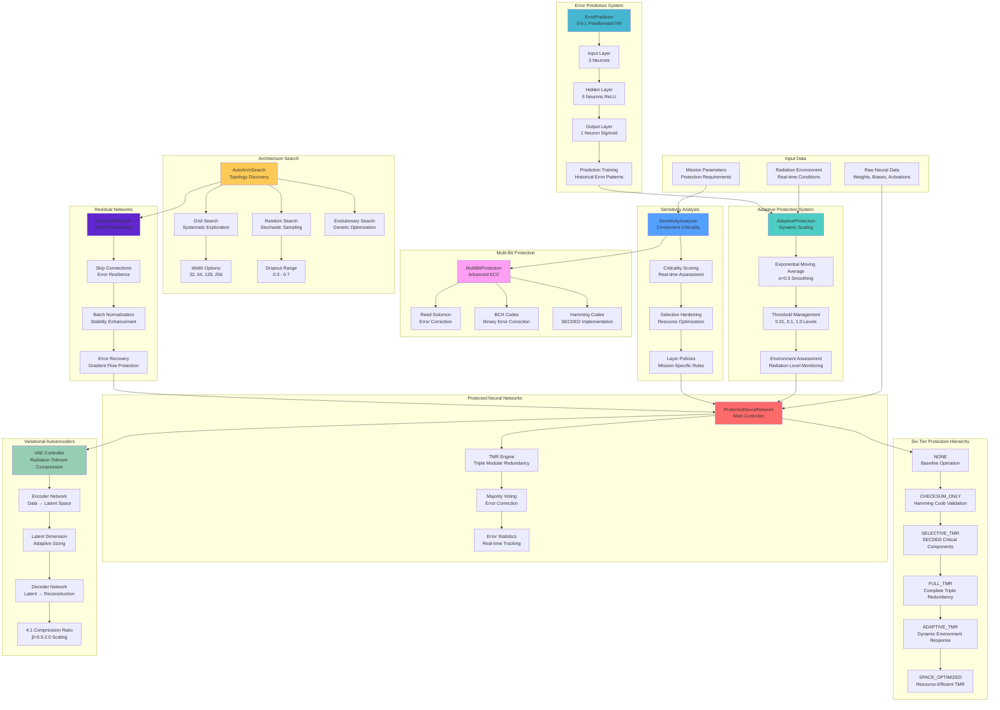

# Neural Network Layer Architecture

**Implementation Notes:**
- Space Weather Integration: Radiation modeling comprehensive, live feeds conceptual
- Hardware Acceleration: Framework exists, GPU integration has limitations
- All core neural protection components fully validated against C++ implementation
